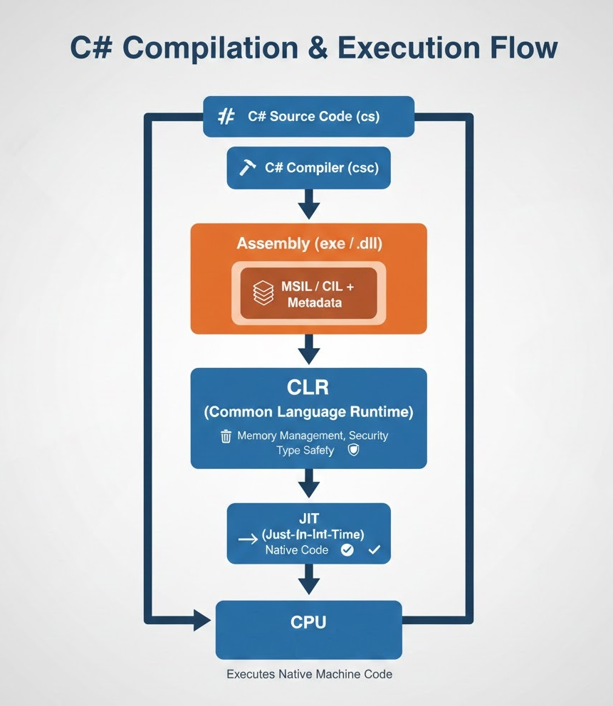

>current vesion of C# is 14.0, .NET 10

---

### Advantages of C#
**Interoperability :** 
- interoperability (interop) refers to the ability of managed C# code to interact with other languages and platforms.

C# can seamlessly interact with other .NET languages like VB.NET or F# because they all compile to the same Common Intermediate Language (CIL) and run on the Common Language Runtime (CLR). 
>*Common Type System (CTS)*: Ensures that data types in one .NET language are understood by another (e.g., an Integer in VB.NET is the same as an int in C#).

>*Common Language Specification (CLS)*: A set of rules that, if followed, ensures a library written in one language can be consumed by any other .NET language. 

**Memory Management :**
- C# uses a garbage collector (GC) to automatically manage memory allocation and deallocation. This reduces the chances of memory leaks and other memory-related issues, making it easier for developers to write robust applications.

**Type Safety :**
- C# is a statically typed language, which means that type checking is done at compile-time. This helps catch errors early in the development process, leading to more reliable and maintainable code.

**Ease of Use**
- Syntax allows for users to familier to c,c++ or java to easily start coding in C# very effortlessly.

---

## .NET core - Code Execution


### **1. Compilation Step (Build Time)**

**What happens:**

| Step                              | Description                                                                                                                                                                                                 |
| --------------------------------- | ----------------------------------------------------------------------------------------------------------------------------------------------------------------------------------------------------------- |
| **C# Source Code (.cs)**          | Your human-readable C# program                                                                                                                                                                              |
| **C# Compiler (csc)**             | Compiles source code into **MSIL** + metadata                                                                                                                                                               |
| **Assembly Output (.exe / .dll)** | - Contains **MSIL / CIL** (CPU-independent intermediate code) <br> - Contains **Metadata** (types, methods, references, attributes) <br> - `.exe` → has entry point `Main()` <br> - `.dll` → no entry point |

**Notes:**

* MSIL = Microsoft Intermediate Language
* CIL = Common Intermediate Language (standard, ECMA-335)
* MSIL is Microsoft’s implementation of CIL; both are **almost the same**.
* **Purpose:** Allows **“compile once, run anywhere”** on any .NET runtime.


### **2. Execution Step (Runtime)**

**What happens:**

| Step                              | Description                                                               |
| --------------------------------- | ------------------------------------------------------------------------- |
| **CLR (Common Language Runtime)** | Loads the assembly into memory                                            |
| **JIT Compiler (Just-In-Time)**   | Converts **MSIL → native machine code**, method by method, **at runtime** |
| **CPU Execution**                 | Executes the generated native machine code                                |

**Notes:**

* JIT compilation happens **only when a method is first executed**.
* Native code is **cached in memory** for reuse.
* Optional: .NET can use **Ahead-of-Time (AOT) compilation** or **ReadyToRun** to precompile MSIL for faster startup.

---

## **3. Key Points to Remember**

1. `.exe` and `.dll` contain **MSIL/CIL**, **not native machine code**.
2. **MSIL is created at compile time**.
3. **Native machine code is created at runtime** by JIT.
4. Metadata in assemblies is used by the CLR for type safety, reflection, and execution.
5. **MSIL → portable intermediate code**; JIT → converts it to CPU-specific instructions.

---

## **4. MSIL vs CIL (Quick Comparison)**

| Term        | Meaning                                        | Key Info                                                    |
| ----------- | ---------------------------------------------- | ----------------------------------------------------------- |
| **CIL**     | Common Intermediate Language                   | Standard defined by ECMA-335; cross-platform .NET spec      |
| **MSIL**    | Microsoft Intermediate Language                | Microsoft’s implementation of CIL; same instructions as CIL |
| **Purpose** | Write once → run anywhere on any .NET platform | Allows portability, security, and runtime optimizations     |

---

## **5. Flow Diagram – Compilation to Execution**

```
   C# Source Code (.cs)
            │
            ▼
   C# Compiler (csc)
            │
            ▼
  ┌─────────────────────┐
  │   Assembly (.exe /   │
  │       .dll)          │
  │ ┌─────────────────┐ │
  │ │    MSIL / CIL    │ │ <- CPU-independent intermediate code
  │ │    Metadata      │ │ <- info about classes, methods, references
  │ └─────────────────┘ │
  └───────────┬─────────┘
              ▼
        CLR (Runtime)
              │
              ▼
        JIT Compiler
  Converts MSIL → Native Machine Code
              │
              ▼
         CPU Executes
```

---

## **6. Memory Tip / Easy Way to Remember**

> **“C# → MSIL → JIT → Machine Code → CPU executes”**

> Compile-time = `.exe/.dll` with MSIL

> Runtime = CLR + JIT → native code



---

## 1️⃣ What is “garbage” in C#?

In C#, **garbage refers to objects in memory that are no longer accessible** by your program.

>💡 C# Garbage Collector primarily collects heap-allocated objects that are no longer referenced, leaving stack memory and unmanaged resources untouched.

### Examples of garbage:

```csharp
class Person { public string Name; }

Person p1 = new Person();  // p1 points to a Person object
p1 = null;                  // The Person object has no references now → garbage
```

* The object created with `new Person()` **still exists in memory**.
* But since `p1` is set to `null`, **nothing can access it**.
* That object is now **eligible for garbage collection**.

Another example:

```csharp
Person p1 = new Person();
Person p2 = p1; // both p1 and p2 point to the same object

p1 = null;      // object is NOT garbage yet because p2 still references it
p2 = null;      // now the object has no references → becomes garbage
```

✅ **Key point:** Garbage = **memory that can no longer be reached by your code**.

---

## 2️⃣ What does C# Garbage Collector (GC) do?

* C# has **automatic garbage collection** (unlike C++ where you must manually free memory).
* The **GC frees memory of objects that are no longer in use**.

### Example:

```csharp
class Demo
{
    static void Main()
    {
        Person p = new Person();
        p = null; // object is now eligible for GC
        GC.Collect(); // optionally force GC (not usually needed)
    }
}
```

* The GC **reclaims memory** so it can be used for new objects.
* GC also **runs periodically**, based on memory pressure, not immediately when an object becomes unreachable.

---

## 3️⃣ What the GC collects

1. **Heap memory** objects (created via `new`)

   * Classes, arrays, strings (reference types)
2. **Objects that are no longer referenced** anywhere in the program
3. **Large objects** in the Large Object Heap (LOH)
4. **Unused resources if `IDisposable` not used** (eventually finalized by GC, but best practice: use `Dispose`/`using`)

❌ GC does **not collect**:

* Stack variables (local value types) — automatically removed when the function ends
* Objects still referenced somewhere
* External unmanaged resources (like files, database connections) — these need manual disposal

---

## 4️⃣ Garbage Collection Stages (simplified)

1. **Mark** → find all objects that are no longer reachable
2. **Sweep** → free the memory of unreachable objects
3. **Compact** → optional, move objects to reduce fragmentation

---

## 5️⃣ Why is this useful?

* **Prevents memory leaks**
* **Simplifies coding** (no manual `delete` like in C++)
* **Improves reliability**, because you don’t accidentally free memory still in use

---

### ✅ Summary Table

| Term                   | Meaning                                                     |
| ---------------------- | ----------------------------------------------------------- |
| Garbage                | Memory occupied by objects that are no longer referenced    |
| GC (Garbage Collector) | Automatic system in C# that frees memory of garbage objects |
| Not collected by GC    | Stack variables, referenced objects, unmanaged resources    |

---

### Data Types in C#
C# has two main categories of data types: **Value Types** and **Reference Types**.
1. **Value Types**: 
   - Store the actual data directly.
   - Examples: `int`, `float`, `bool`, `char`, `struct`, `enum`.
   - Stored in the stack memory.
   - When assigned to a new variable, a copy of the value is made.
2. **Reference Types**: 
    - Store a reference (address) to the actual data.
    - Examples: `class`, `array`, `string`, `interface`, `delegate`.
    - Stored in the heap memory.
    - When assigned to a new variable, a copy of the reference is made, not the actual data.


### Summary Table
| Data Type       | Storage Location | Example Types               | Assignment Behavior                |
| --------------- | ---------------- | --------------------------- | ---------------------------------- |
| Value Types     | Stack            | `int`, `float`, `bool`, `char`, `struct`, `enum`,`DateTime` | Copies the actual value            |
| Reference Types | Heap             | `class`, `array`, `string`, `interface`, `delegate`, `StringBuilder`, `object`, `Collections` | Copies the reference (address)     |
### Example Code
```csharp
// Value Type Example
int a = 10;
int b = a; // b gets a copy of the value of a
b = 20; // Changing b does not affect a
Console.WriteLine(a); // Outputs: 10
// Reference Type Example
class Person
{
    public string Name;
}
Person p1 = new Person();
p1.Name = "Alice";
Person p2 = p1; // p2 references the same object as p1
p2.Name = "Bob"; // Changing p2 affects p1
Console.WriteLine(p1.Name); // Outputs: Bob
```
### Key Points
- Value types are stored in **stack memory** and hold the actual data. [It will store data directly hence it is also called *direct memory allocation*.]
- Reference types are stored in **heap memory** and hold a reference to the data. [It is also called *indirect memory allocation.*]
- Assigning value types creates a copy of the data, while assigning reference types creates a copy of the reference.


### Boxing and UnBoxing
**Boxing** is the process of converting a value type to a reference type by wrapping the value inside an object. This allows value types to be treated as objects. [implicit - we do not need to casting explicitly] 
```csharp
int num = 42; // Value type
object obj = num; // Boxing: num is wrapped in an object
```
**Unboxing** is the reverse process, where the value is extracted from the object back to its original value type. [explicit - we need typecasting explicitaly]
```csharp
object obj = 42; // Reference type
int num = (int)obj; // Unboxing: extracting the value back to int
```
**Key Points**
- Boxing incurs a performance cost due to heap allocation.
- Unboxing requires an explicit cast and can throw an `InvalidCastException` if the types do not match.


### Variable, Constant and Literals in C#
- **Variable**: A variable is a named storage location in memory that holds a value which can be changed during program execution. 
  ```csharp
  int age = 25; // 'age' is a variable of type int
  age = 30; // The value of 'age' can be changed
  ```
- **Constant**: A constant is a named storage location in memory that holds a value which cannot be changed after it is initialized. Constants are declared using the `const` keyword.
> Assigning value at time of declation of a constant is mandatory. but not in the case of variable.
  ```csharp
    const double PI = 3.14159; // 'PI' is a constant of type double
    // PI = 3.14; // This would cause a compile-time error
    ```
- **Literals**: Literals are fixed values that are directly written in the code. They represent constant values of various data types.
    ```csharp
    int number = 100; // 100 is an integer literal
    string message = "Hello, World!"; // "Hello, World!" is a string literal
    bool isActive = true; // true is a boolean literal
    ```
> **Declaration** tells the compiler about the variable's and reserves memory for it. **Initialization** assigns an initial value to the variable.

### Naming convention
- Do not use keyword as variable names.
- Do not startwith number or symbol.
- you can startwith '_' (underscore) symbols.
- Use PascleCase or camelCase for local variables and parameters. [recomanded by C#]

```csharp
int FirstNumber = 20; // Pascle Case
int secondNumber = 30; // camel Case
```

### Type Inference and Dynamic Type
- **Type Inference**: C# supports type inference using the `var` keyword, which allows the compiler to automatically determine the type of a variable based on the assigned value at compile time. [introduce in C#3.0] [loosly ]
  ```csharp
  var number = 42; // Compiler infers 'number' as int
  var message = "Hello, World!"; // Compiler infers 'message' as string
  ```
- **Dynamic Type**: C# also supports dynamic typing using the `dynamic` keyword, which allows a variable to hold any type of value, and the type is resolved at runtime. [introduce in C#4.0]
  ```csharp
    dynamic data = 10; // 'data' is initially an int
    data = "Now I'm a string"; // 'data' can now hold a string
    ```
### Operators in C#
Operator is used to perform opration using operands. Operand can be a variable, constant or literals.
**Type of Operators on the basis of number of operands:-**
- **Unary Operators**: Operate on a single operand. E.g., `++`, `--`, `!`
- **Binary Operators**: Operate on two operands. E.g., `+`, `-`, `*`, `/`, `==`
- **Ternary Operator**: Operate on three operands. E.g., `? :`

**Commonly Used Operators in C#:**
- **Arithmetic Operators**: `+`, `-`, `*`, `/`, `%`
    ```csharp
    int sum = 5 + 3; // sum is 8
    int product = 4 * 2; // product is 8
    ```
- **Comparison Operators**: `==`, `!=`, `>`, `<`, `>=`, `<=`
    ```csharp
    bool isEqual = (5 == 5); // isEqual is true
    bool isGreater = (7 > 3); // isGreater is true
    ```
- **Logical Operators**: `&&`, `||`, `!`
    ```csharp
    bool result = (true && false); // result is false
    bool notResult = !true; // notResult is false
    ```
- **Assignment Operators**: `=`, `+=`, `-=`, `*=`, `/=`
    ```csharp
    int x = 10; // Assignment
    x += 5; // x is now 15
    ```
- **Increment and Decrement Operators**: `++`, `--`
    ```csharp
    int count = 0;
    count++; // count is now 1
    count--; // count is now 0
    ```
- **pre-increment :** It will first increase the values then perform other opetion to that operand.
- **post-increment :** It will first perform other opetion to that operand then increase the values.
```csharp
int a = 5;
int b = a++; // first b will assigned the value of a, means value of b will be 5, then a increase by one and become 6
int c = ++a; // first a will increase by one and become 7, then c will assigned the value of a, means value of c will be 7
```

- **Ternary Operator**: `? :`
    ```csharp
    int max = (5 > 3) ? 5 : 3; // max is 5
    ```
### Summary Table of Operators
| Operator Type          | Operators                     | Example                          |
| ---------------------- | ----------------------------- | -------------------------------- |
| Arithmetic Operators   | `+`, `-`, `*`, `/`, `%`      | `int sum = 5 + 3;`              |
| Comparison Operators   | `==`, `!=`, `>`, `<`, `>=`, `<=` | `bool isEqual = (5 == 5);`      |
| Logical Operators      | `&&`, `||`, `!`              | `bool result = (true && false);` |
| Assignment Operators   | `=`, `+=`, `-=`, `*=`, `/=`   | `x += 5;`                       |
| Increment/Decrement    | `++`, `--`                   | `count++;`                      |
| Ternary Operator       | `? :`                         | `int max = (5 > 3) ? 5 : 3;`    |

> **Notes :** == and .Equals()
```csharp
int a=10;
long b=10;
Console.WriteLine(a==b); // True , as type checking no performed due implcit conversion.
Console.WriteLine(a.Equals(b)); // False, due to type checking
string str1="hello";
string str2=new string(new char[]{'h','e','l','l','o'});
Console.WriteLine(str1==str2); // True, as == operator is overloaded in string class to compare values.
Console.WriteLine(str1.Equals(str2)); // True, as values are same.
```

### Conditionals
C# provides several conditional statements to control the flow of execution based on certain conditions.

1. **if-else ladder :** 
- else if and else is not mandatory.

```csharp
int number = 10;
if (number > 0)
{
    Console.WriteLine("Positive number");
}
else if (number < 0)
{
    Console.WriteLine("Negative number");
}
else
{
    Console.WriteLine("Zero");
}
```
2. **switch-case :** 
```csharp
int day = 3;
switch (day)
{
    case 1:
    case 2:
    case 3:
    case 4:
        Console.WriteLine("Formal");
        break;
    case 5:
        Console.WriteLine("Cauals");
        break;
    default:
        Console.WriteLine("Weekend");
        break;
}
```
**Advantages of Switch statement :**
- Faster and Efficient execution especially for large numbers of conditions.
- Improved readability and maintainability of code.

**Disadvantages of Switch statement :**
- Limited to discrete values (integers,char, enums, strings).
- Operate on Only one variable.

**Summary table of if-else ladder and switch statement**
| Feature               | if-else ladder                          | switch-case                            |
| --------------------- | -------------------------------------- | -------------------------------------- |
| Use Case              | Complex conditions, ranges             | Discrete values, single variable       |
| Readability           | Can become complex with many conditions | More readable for multiple discrete cases |
| Performance           | Slower for many conditions             | Faster for many discrete cases         |


### Loops in C# [Control statement or Iterative statment]
- A loop is a block of code that repeats a given number of times or untill a centain condion is met.
- Loops are used to simplify task and automate repetitive tasks.
- Example :  
- C# provides several types of loops to execute a block of code multiple times based on certain conditions.
1. **for loop :** 
```csharp
for (int i = 0; i < 5; i++)
{
    Console.WriteLine("Iteration: " + i);
}
```
2. **while loop :** 
```csharp
int i = 0;
while (i < 5)
{
    Console.WriteLine("Iteration: " + i);
    i++;
}
```
3. **do-while loop :** 
```csharp
int i = 0;
do
{
    Console.WriteLine("Iteration: " + i);
    i++;
} while (i < 5);
```
4. **foreach loop :**
```csharp
string[] fruits = { "Apple", "Banana", "Cherry" };
foreach (string fruit in fruits)
{
    Console.WriteLine(fruit);
}
```
### diffrent ways of input and output in c#
1. **Using Console Class :** 
```csharp
// Output
Console.WriteLine("Hello, World!");
// Input
string input = Console.ReadLine();
char c = (char) Console.Read(); // only for charactor input
int num = int.Parse(Console.ReadLine());
int num = Convert.ToInt32(Console.ReadLine());
```
2. **Using String Interpolation :** 
```csharp
string name = "Alice";
Console.WriteLine($"Hello, {name}!");
Console.WriteLine("Hello, {0}",name);
Console.WriteLine("Hello, "+name);
```
3. **Using Format Specifiers :** 
```csharp
int age = 25;
Console.WriteLine("I am {0} years old.", age);
````
4. **Using String.Format Method :** 
```csharp
string name = "Bob";
string message = String.Format("Hello, {0}!", name);
Console.WriteLine(message);
```
### Set precision 
```csharp
double pi = 3.14159265359;
Console.WriteLine("Pi to 2 decimal places: {0:F2}", pi); // Outputs: Pi to 2 decimal places: 3.14
Console.WriteLine($"Pi to 4 decimal places: {pi:F4}"); // Outputs: Pi to 4 decimal places: 3.1416
```
### Array
- An array is a collection of similar data [homogeneus] which stored in contiguas memory location.
- Arrays are used to store multiple values in a single variable, instead of declaring separate variables for each value.
- It is referance variable.
```csharp
// Declaration and Initialization
int[] numbers = new int[3]; // Array of 5 integers
numbers[0] = 10;
numbers[1] = 20;
numbers[2] = 30;
// Or
int[] numbers = { 10, 20, 30 }; // Array initialization
// Accessing Array Elements
for (int i = 0; i < numbers.Length; i++)
    Console.WriteLine(numbers[i]);
```
**Multi-dimentional array**
```csharp
int[,] matrix = new int[2, 3]; // 2 rows, 3 columns
matrix[0, 0] = 1;
matrix[0, 1] = 2;
matrix[0, 2] = 3;
matrix[1, 0] = 4;
matrix[1, 1] = 5;
matrix[1, 2] = 6;
// other way for 3D
int[,,] threeD = new int[2, 2, 2]
{
    { {1, 2}, {3, 4} },
    { {5, 6}, {7, 8} }
};
// Accessing Multi-dimensional Array Elements
for (int i = 0; i < 2; i++)
    for (int j = 0; j < 3; j++)
        Console.WriteLine(matrix[i, j]);
```

#### **Jagged Array**
- In this array, every row can have diffterent size of array.
```csharp
int[][] jaggedArray = new int[3][];
jaggedArray[0] = new int[] { 1, 2 };
jaggedArray[1] = new int[] { 6, 7, 8, 9 };
jaggedArray[2] = new int[] { 3, 4, 5 };
// Accessing Jagged Array Elements
for (int i = 0; i < jaggedArray.Length; i++)
    for (int j = 0; j < jaggedArray[i].Length; j++)
        Console.WriteLine(jaggedArray[i][j]);
```
#### **Object Array**
- An object array can store elements of different data types.
```csharp
object[] mixedArray = { 10, "Hello", 3.14, true };
for (int i = 0; i < mixedArray.Length; i++)
    Console.WriteLine(mixedArray[i]);

foreach(object obj in mixedArray)
    Console.WriteLine(obj);
```

### string in C#
- A string is a sequence of characters used to represent text.
- In C#, strings are immutable, meaning that once a System.String object is created in memory, its value cannot be changed. 

**How strings are stored**
- Strings are stored in the heap memory as objects of the `System.String` class.

**Why Strings are Immutable?**
- **Performance**: Immutable strings can be shared safely across multiple threads without synchronization.
- **Security**: Immutable strings prevent accidental or malicious modifications.
- **Thread Safety**: 

```csharp
string greeting = "Hello, World!";
Console.WriteLine(greeting); // Outputs: Hello, World!
```
**Operations in strings**
```csharp
string str1 = "Hello";
string str2 = "World";
// Concatenation
string combined = str1 + ", " + str2 + "!";
Console.WriteLine(combined); // Outputs: Hello, World!
// Length
int length = combined.Length;
Console.WriteLine(length); // Outputs: 13
// Substring
string sub = combined.Substring(7, 5);
Console.WriteLine(sub); // Outputs: World
// Replace
string replaced = combined.Replace("World", "C#");
Console.WriteLine(replaced); // Outputs: Hello, C#!
// Split
string[] words = combined.Split(' ');
foreach (string word in words)
    Console.WriteLine(word);
// output
// Hello,
// World!
// ToUpper and ToLower
string upper = combined.ToUpper();
Console.WriteLine(upper); // Outputs: HELLO, WORLD!
string lower = combined.ToLower();
Console.WriteLine(lower); // Outputs: hello, world!
// Trim
string spaced = "   Hello, C#!   ";
string trimmed = spaced.Trim();
Console.WriteLine(trimmed); // Outputs: Hello, C#!
```


### OOPS in C# 
- C# is an object-oriented programming (OOP) language that supports the following four main principles of OOP:
1. **Encapsulation**: 
   - Encapsulation is the concept of bundling data (attributes) and methods (functions) that operate on the data into a single unit called a class. It restricts direct access to some of an object's components, which helps prevent unintended interference and misuse of the data.
   - In C#, encapsulation is achieved using access modifiers like `public`, `private`, `protected`, and `internal`.
2. **Inheritance**:
    - Inheritance is a mechanism that allows a new class (derived class) to inherit properties and behaviors (methods) from an existing class (base class). This promotes code reusability and establishes a hierarchical relationship between classes.
    - In C#, inheritance is implemented using the `:` symbol.
3. **Polymorphism**:
    - Polymorphism allows methods to do different things based on the object that it is acting upon, even though they share the same name. It enables a single interface to represent different underlying forms (data types).
    - In C#, polymorphism can be achieved through method overriding (runtime polymorphism) and method overloading (compile-time polymorphism).
4. **Abstraction**:
    - Abstraction is the concept of hiding the complex implementation details and showing only the essential features of the object. It helps in reducing complexity and increases efficiency.
    - In C#, abstraction can be achieved using abstract classes and interfaces.

**CLASS :** A class is a blueprint of object that defines its basic structure and behaivior. It is like a template or a reference to create objects.

**OBJECT :** An object is instance of a class that has its own identity state and behavior. It is created using class and can be mainulated in a program.

> *Classes* and *Objects* allows developers to efficienctly create, modify and maintain a large amount of data. They are basic building blocks of OOPS.

```csharp
// Class Definition
public class Car
{
    // Fields (Attributes)
    private string color;
    private string model;

    // Constructor
    public Car(string color, string model)
    {
        this.color = color;
        this.model = model;
    }

    // Method (Behavior)
    public void Drive()
    {
        Console.WriteLine($"The {color} {model} is driving.");
    }
}
// Creating an Object
Car myCar = new Car("Red", "Toyota");
myCar.Drive(); // Outputs: The Red Toyota is driving.
```


### References
- [Microsoft C# Documentation](https://learn.microsoft.com/en-us/dotnet/csharp/)